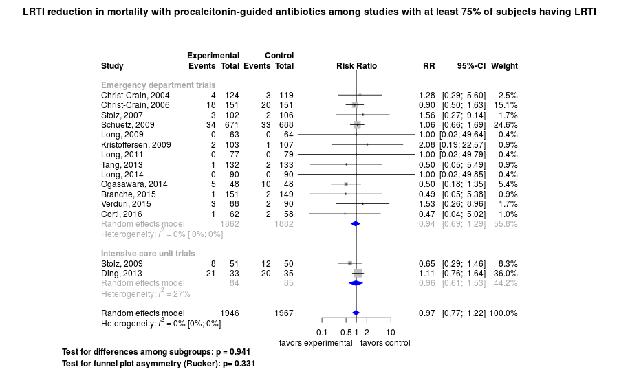

Lower respiratory tract infection treatment guided by procalcitonin
============================================
A living systematic review

**Clinical summary:** This meta-analysis suggests that clinical intervention *is not* effective when the analysis is restricted to trials in which at lesat 75% of subjects had lower respiratory tract infection. In addition, meta-regression suggests that increased compliance with the procalcitonin protocol within a trial correlates with *less* benefit. Lastly, in most trials, the quality of care in the control group [had not been optimized](https://www.wikidoc.org/index.php/Randomized_controlled_trial#Control_group_optimization). Heterogeneity of results as measured by I2 may '[not be important](http://handbook-5-1.cochrane.org/chapter_9/9_5_2_identifying_and_measuring_heterogeneity.htm)' at 0%. This review updates the previously published meta-analysis.(1)

* [Reconciliation of conclusions with prior meta-analyses](files/reconciliation-tables/Reconciliation%20of%20conclusions.pdf)
<!--
* [Keep current with this topic](files/searching/Keep-up.md) (not available)
-->

**Methods overview:** This repository is an [openMetaAnalysis](https://openmetaanalysis.github.io/) that combines methods of scoping, rapid, and living systematic reviews.  This analysis updates one or more previously published review(s).(1) A comparison of studies include in this review compared to prior reviews are in the table, [reconciliation of trials included with prior meta-analyses/](files/reconciliation-tables/Reconciliation%20of%20studies.pdf). Newer studies included are listed in the references below. Rationale for newer trials excluded may be listed at the end of the references. 
* Inclusion criteria for studies: we included trials included by either of the two reviews by Scheutz et al below. 
** We excluded trials in which less than 75% of patients had lower respiratory tract infection.
* [Methods](http://openmetaanalysis.github.io/methods.html) for openMetaAnalysis
* [Evidence search](files/searching/evidence-search.md) for this review 

**Results:** Details of the studies included are in the:
* [Reconciliation of trials included with prior meta-analyses](files/reconciliation-tables/Reconciliation%20of%20studies.pdf)
<!--
* [Description of studies (PICO table)](files/study-details/table-pico.pdf) (under construction)
* [Risk of bias assessment](files/study-details/table-bias.pdf) (under construction)-->
* [Forest plots](../master/files/forest-plots) ([source data](files/data))
<!--* [Network plots](../master/files/network) (optional)-->

The forest plot for the primary outcomes are below. Additional [forest plots](files/forest-plots) of secondary analyses may be available. 

The meta-regression for the primary outcomes are below. Additional [meta-regressions](files/metaregression) of secondary analyses may be available. 

References:
----------------------------------

### Systematic review(s)
#### Most recent review at time of last revision of this repository
1. Schuetz et al. Effect of procalcitonin-guided antibiotic treatment on mortality in acute respiratory infections: a patient level meta-analysis. Lancet Infectious Disease. 2017 doi:[10.1016/S1473-3099(17)30592-3](http://doi.org/10.1016/S1473-3099(17)30592-3) PMID: [29037960](http://pubmed.gov/29037960)
2. Schuetz P, Wirz Y, Sager R, Christ-Crain M, Stolz D, Tamm M, et al. Procalcitonin to initiate or discontinue antibiotics in acute respiratory tract
infections. Cochrane Database Syst Rev. 2017 Oct 13;10:CD007498. doi: [10.1002/14651858.CD007498.pub3](http://doi.org/10.1002/14651858.CD007498.pub3). PMID: [29025194](http://pubmed.gov/29025194)

### Randomized controlled trials
#### New trial(s) *not* included in the most recent review above
1. Huang DT, Yealy DM, Filbin MR, Brown AM, Chang CH, Doi Y, Donnino MW, Fine J, Fine MJ, Fischer MA, Holst JM, Hou PC, Kellum JA, Khan F, Kurz MC, Lotfipour S, LoVecchio F, Peck-Palmer OM, Pike F, Prunty H, Sherwin RL, Southerland L, Terndrup T, Weissfeld LA, Yabes J, Angus DC; ProACT Investigators. Procalcitonin-Guided Use of Antibiotics for Lower Respiratory Tract Infection. N Engl J Med. 2018 Jul 19;379(3):236-249. doi: [10.1056/NEJMoa1802670](http://doi.org/10.1056/NEJMoa1802670). PMID: [29781385](http://pubmed.gov/29781385)

#### Trial(s) included in the review above
1. Corti C, Fally M, Fabricius-Bjerre A, Mortensen K, Jensen BN, Andreassen HF, Porsbjerg C, Knudsen JD, Jensen JU. Point-of-care procalcitonin test to reduce antibiotic exposure in patients hospitalized with acute exacerbation of COPD. Int J Chron Obstruct Pulmon Dis. 2016 Jun 22;11:1381-9. doi: 10.2147/COPD.S104051. PMID: [27382274](http://pubmed.gov/27382274)
2. Branche AR, Walsh EE, Vargas R, Hulbert B, Formica MA, Baran A, Peterson DR, Falsey AR. Serum Procalcitonin Measurement and Viral Testing to Guide Antibiotic  Use for Respiratory Infections in Hospitalized Adults: A Randomized Controlled Trial. J Infect Dis. 2015 Dec 1;212(11):1692-700. doi: 10.1093/infdis/jiv252. PMID: [25910632](http://pubmed.gov/25910632)
3. Verduri A, Luppi F, D'Amico R, Balduzzi S, Vicini R, Liverani A, Ruggieri V, Plebani M, Barbaro MP, Spanevello A, Canonica GW, Papi A, Fabbri LM, Beghè B; FARM58J2XH Study Group. Antibiotic treatment of severe exacerbations of chronic obstructive pulmonary disease with procalcitonin: a randomized noninferiority trial. PLoS One. 2015 Mar 11;10(3):e0118241. doi: 10.1371/journal.pone.0118241. PMID: [25760346](http://pubmed.gov/25760346)
4. Long W, Li LJ, Huang GZ, Zhang XM, Zhang YC, Tang JG, Zhang Y, Lu G. Procalcitonin guidance for reduction of antibiotic use in patients hospitalized with severe acute exacerbations of asthma: a randomized controlled study with 12-month follow-up. Crit Care. 2014 Sep 5;18(5):471. doi: 10.1186/s13054-014-0471-7. PMID: [25189222](http://pubmed.gov/25189222) 
5. Ogasawara T, Umezawa H, Naito Y, Takeuchi T, Kato S, Yano T, Kasamatsu N, Hashizume I. Procalcitonin-guided antibiotic therapy in aspiration pneumonia and an assessment of the continuation of oral intake. Respir Investig. 2014 Mar;52(2):107-13. doi: 10.1016/j.resinv.2013.08.002. PMID: [24636266](http://pubmed.gov/24636266)
6. Tang J, Long W, Yan L, Zhang Y, Xie J, Lu G, Yang C. Procalcitonin guided antibiotic therapy of acute exacerbations of asthma: a randomized controlled trial. BMC Infect Dis. 2013 Dec 17;13:596. doi: 10.1186/1471-2334-13-596. PMID: [24341820](http://pubmed.gov/24341820)
7. Ding J, Chen Z, Feng K. Procalcitonin-guided antibiotic use in acute exacerbations of idiopathic pulmonary fibrosis. Int J Med Sci. 2013 May 20;10(7):903-7. doi: 10.7150/ijms.4972. PMID: [23781136](http://pubmed.gov/23781136)
8. Long W, Deng X, Zhang Y, Lu G, Xie J, Tang J. Procalcitonin guidance for reduction of antibiotic use in low-risk outpatients with community-acquired pneumonia. Respirology. 2011 Jul;16(5):819-24. doi: 10.1111/j.1440-1843.2011.01978.x. PMID: [21507143](http://pubmed.gov/21507143)
9. Stolz D, Smyrnios N, Eggimann P, Pargger H, Thakkar N, Siegemund M, Marsch S, Azzola A, Rakic J, Mueller B, Tamm M. Procalcitonin for reduced antibiotic exposure in ventilator-associated pneumonia: a randomised study. Eur Respir J. 2009 Dec;34(6):1364-75. doi: 10.1183/09031936.00053209. PMID: [19797133](http://pubmed.gov/19797133)
10. Schuetz P, Christ-Crain M, Thomann R, Falconnier C, Wolbers M, Widmer I, Neidert S, Fricker T, Blum C, Schild U, Regez K, Schoenenberger R, Henzen C, Bregenzer T, Hoess C, Krause M, Bucher HC, Zimmerli W, Mueller B; ProHOSP Study Group. Effect of procalcitonin-based guidelines vs standard guidelines on antibiotic use in lower respiratory tract infections: the ProHOSP randomized
controlled trial. JAMA. 2009 Sep 9;302(10):1059-66. doi: 10.1001/jama.2009.1297. PMID: [19738090](http://pubmed.gov/19738090)
11. Kristoffersen KB, Søgaard OS, Wejse C, Black FT, Greve T, Tarp B, Storgaard M, Sodemann M. Antibiotic treatment interruption of suspected lower respiratory tract infections based on a single procalcitonin measurement at hospital admission--a randomized trial. Clin Microbiol Infect. 2009 May;15(5):481-7. doi: 10.1111/j.1469-0691.2009.02709.x. PMID: [19416298](http://pubmed.gov/19416298)
12. Long W, Deng XQ, Tang JG, Xie J, Zhang YC, Zhang Y, Gao YY, Lu G. [The value of serum procalcitonin in treatment of community acquired pneumonia in outpatient]. Zhonghua Nei Ke Za Zhi. 2009 Mar;48(3):216-9. PMID: [19576090](http://pubmed.gov/19576090)
13. Christ-Crain M, Stolz D, Bingisser R, Müller C, Miedinger D, Huber PR, Zimmerli W, Harbarth S, Tamm M, Müller B. Procalcitonin guidance of antibiotic therapy in community-acquired pneumonia: a randomized trial. Am J Respir Crit Care Med. 2006 Jul 1;174(1):84-93. PMID: [16603606](http://pubmed.gov/16603606)
14. Christ-Crain M, Jaccard-Stolz D, Bingisser R, Gencay MM, Huber PR, Tamm M, Müller B. Effect of procalcitonin-guided treatment on antibiotic use and outcome in lower respiratory tract infections: cluster-randomised, single-blinded intervention trial. Lancet. 2004 Feb 21;363(9409):600-7. PMID: [14987884](http://pubmed.gov/14987884)

#### Trial(s) undergoing review
1. Huang DT, Yealy DM, Filbin MR, et al; ProACT Investigators. Procalcitonin-Guided Use of Antibiotics for Lower Respiratory Tract Infection. N Engl J Med. 2018 May 20. doi: [10.1056/NEJMoa1802670](http://doi.org/10.1056/NEJMoa1802670). PMID: [29781385](http://pubmed.gov/29781385)

#### Trial(s) excluded - selected list of important trial(s)
1. Wang JX, Zhang SM, Li XH, Zhang Y, Xu ZY, Cao B. Acute exacerbations of chronic obstructive pulmonary disease with low serum procalcitonin values do not benefit from antibiotic treatment: a prospective randomized controlled trial. Int J Infect Dis. 2016 Jul;48:40-5. doi: 10.1016/j.ijid.2016.04.024. PMID: [27155210](http://pubmed.gov/27155210) *Was not a trial of PCT-guided algorithm. [Details](https://github.com/openMetaAnalysis/Pneumonia-treatment-guided-by-procalcitonin/issues/3)*

Additional trials excluded because < 75% of patients had lower respiratory tract infection.

#### Cited by
This repository is cited by:

1. WikiDoc contributors. Procalcitonin. WikiDoc. Nov 9, 2017. Available at: https://www.wikidoc.org/index.php/Procalcitonin#Guiding_antibiotic_therapy. Accessed November 9, 2017. 

-------------------------------
[Cite and use this content](https://github.com/openMetaAnalysis/openMetaAnalysis.github.io/blob/master/reusing.MD)  - [Edit this page](../../edit/master/README.md) - [History](../../commits/master/README.md)  - 
[Issues and comments](../../issues?q=is%3Aboth+is%3Aissue)

