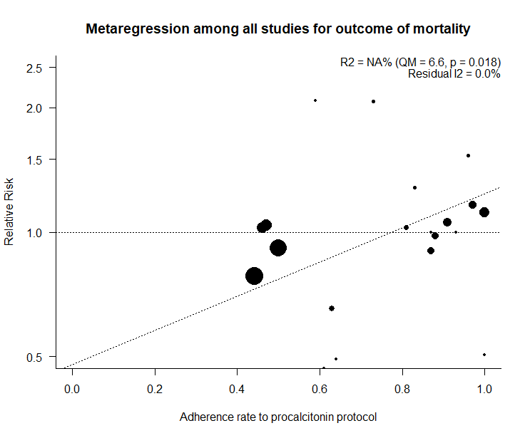

Data-only living review: pneumonia treatment guided by procalcitonin
============================================
A living systematic review

**Clinical summary:** This meta-analysis suggests that clinical intervention *is or is not* effective. Heterogeneity of results as measured by I2 was '[moderate](http://handbook.cochrane.org/chapter_9/9_5_2_identifying_and_measuring_heterogeneity.htm)' at XX%. This review updates the previously published meta-analysis.(1)

* [Reconciliation of conclusions with prior meta-analyses](files/reconciliation-tables/Reconciliation%20of%20conclusions.pdf) (under construction)
* [Keep current with this topic](files/searching/Keep-up.md) (not available)

**Methods overview:** This repository is an [openMetaAnalysis](https://openmetaanalysis.github.io/) that combines methods of scoping, rapid, and living systematic reviews.  This analysis updates one or more previously published review(s).(1) A comparison of studies include in this review compared to prior reviews are in the table, [reconciliation of trials included with prior meta-analyses/](files/reconciliation-tables/Reconciliation%20of%20studies.pdf). Newer studies included are listed in the references below. Rationale for newer trials excluded may be listed at the end of the references. 
* Inclusion criteria for studies: we included trials included by either of the two reviews by Scheutz et al below. 
** We excluded trials in which less than 80% of patients had lower respiratory tract infection.
* [Methods](http://openmetaanalysis.github.io/methods.html) for openMetaAnalysis
* [Evidence search](files/searching/evidence-search.md) for this review (under construction)

**Results:** Details of the studies included are in the:
<!--* [Reconciliation of trials included with prior meta-analyses/](files/reconciliation-tables/Reconciliation%20of%20studies.pdf) (under construction)
* [Description of studies (PICO table)](files/study-details/table-pico.pdf) (under construction)-->
* [Risk of bias assessment](files/study-details/table-bias.pdf) (under construction)
* [Forest plots](../master/files/forest-plots) ([source data](files/data))
<!--* [Network plots](../master/files/network) (optional)-->

The forest plot for the primary outcomes are below. Additional [forest plots](files/forest-plots) of secondary analyses may be available. 

The meta-regression for the primary outcomes are below. Additional [meta-regressions](files/metaregression) of secondary analyses may be available. 

References:
----------------------------------

### Systematic review(s)
#### Most recent review at time of last revision of this repository
1. Schuetz et al. Effect of procalcitonin-guided antibiotic treatment on mortality in acute respiratory infections: a patient level meta-analysis. Lancet Infectious Disease. 2017 doi:[10.1016/S1473-3099(17)30592-3](http://doi.org/10.1016/S1473-3099(17)30592-3)
2. Schuetz P, Wirz Y, Sager R, Christ-Crain M, Stolz D, Tamm M, et al. Procalcitonin to initiate or discontinue antibiotics in acute respiratory tract
infections. Cochrane Database Syst Rev. 2017 Oct 13;10:CD007498. doi: [10.1002/14651858.CD007498.pub3](http://doi.org/10.1002/14651858.CD007498.pub3). PMID: [29025194](http://pubmed.gov/29025194)

### Randomized controlled trials
#### New trial(s) *not* included in the most recent review above
1. None

#### Trial(s) included in the review above
1. 

#### Trial(s) undergoing review
None

#### Trial(s) excluded - selected list of important trial(s)

#### Cited by
This repository is cited by:

1. WikiDoc contributors. Pending. WikiDoc. Nov 9, 2014. Available at: http://www.wikidoc.org/index.php/This_topic. Accessed November 9, 2014. 

-------------------------------
[Cite and use this content](https://github.com/openMetaAnalysis/openMetaAnalysis.github.io/blob/master/reusing.MD)  - [Edit this page](../../edit/master/README.md) - [History](../../commits/master/README.md)  - 
[Issues and comments](../../issues?q=is%3Aboth+is%3Aissue)

